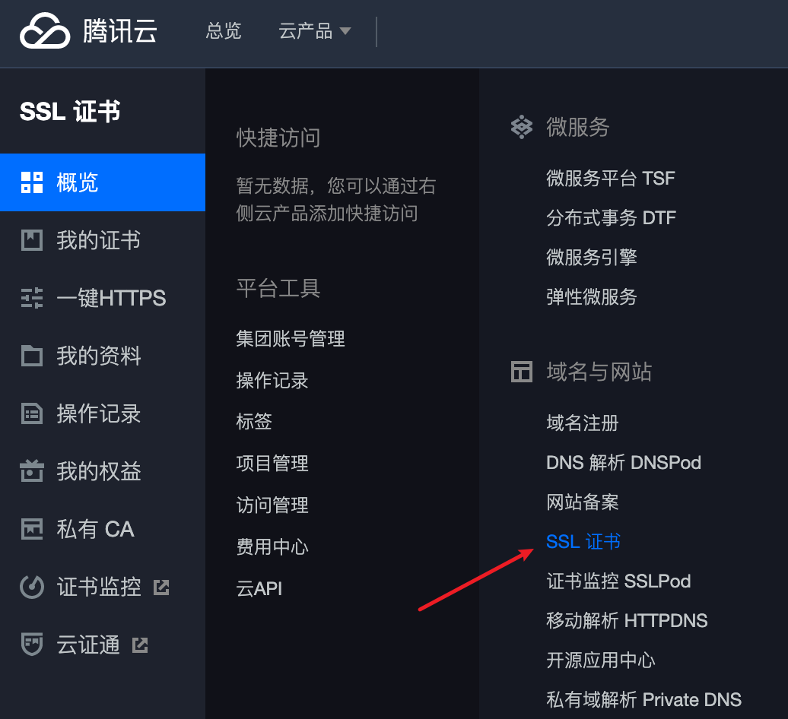
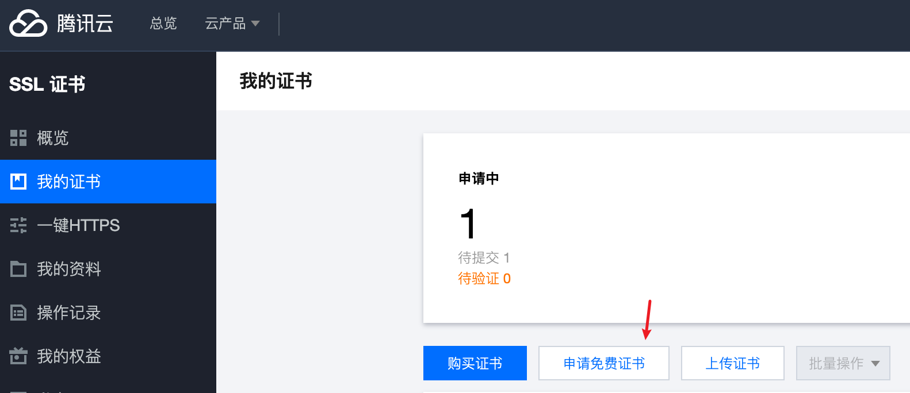
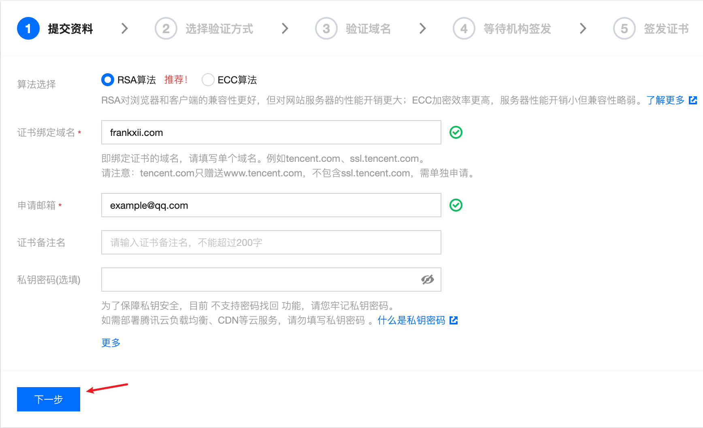
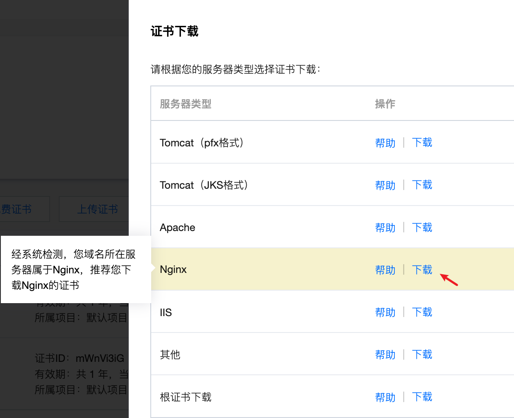
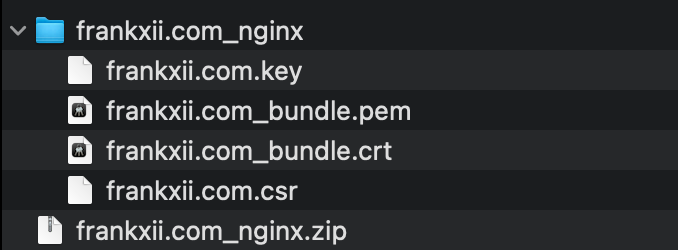

## 前言
通常，使用Nginx直接搭建的静态网站或其他后端web框架开发的网站，都是直接使用http协议，而我们日常访问的商用网站，基本都是https协议。  

这两者有什么区别？使用https有什么优点？我们又应该如何从http切换成https呢？

---
## 申请SSL证书
SSL证书可以直接在云服务器厂商的管理后台上申请，我使用的腾讯云，可在管理后台找到证书管理



点击申请免费证书



填写表单然后等待审核，私钥密码可以不填，填写表单后差不多半小时能申请下来



---
## Nginx配置

审批通过之后，可以在我的证书里面找到对应证书，点击下载



下载后的文件夹解压后如下图所示



可通过scp命令把crt文件和key文件上传到服务器
```bash
scp ./frankxii.com.key user@host:~
scp ./frankxii.com_bundle.crt user@host:~
```

上传到服务器之后，可把附件剪切到Nginx配置文件夹，我的目录在`/etc/nginx`
```bash
# 切换到nginx目录
cd /etc/nginx
# 创建cert文件夹
mkdir cert

# 切换到用户目录
cd ~
# 移动证书文件
mv frankxii.com.key /etc/nginx/cert
mv frankxii.com_bundle.crt /etc/nginx/cert

# 打开nginx配置文件，请参照您自己的配置文件
cd /etc/nginx
sudo vi nginx.conf
```

修改配置
```bash
server {
   listen 443 ssl;
    #填写绑定证书的域名
    server_name frankxii.com www.frankxii.com; 
    #证书文件名称
    ssl_certificate  cert/frankxii.com_bundle.crt; 
    #私钥文件名称
    ssl_certificate_key frankxii.com.key; 
    ssl_session_timeout 5m;
    ssl_ciphers ECDHE-RSA-AES128-GCM-SHA256:ECDHE:ECDH:AES:HIGH:!NULL:!aNULL:!MD5:!ADH:!RC4;
    ssl_protocols TLSv1.2 TLSv1.3;
    ssl_prefer_server_ciphers on;
    location / {
            #网站主页路径。此路径仅供参考，具体请您按照实际目录操作。 
            #例如，您的网站运行目录在/etc/www下，则填写/etc/www。
        root html;
        index index.html index.htm;
    }
}
server {
    listen 80;
    #填写绑定证书的域名
    server_name cloud.tencent.com; 
    #把http的域名请求转成https
    return 301 https://$host$request_uri; 
}
```

vi 编辑器使用 `:wq` 保存

使用命令 `sudo systemctl restart nginx` 重启 或 `sudo nginx -s reload` 重新加载配置，搞定


---
参考文章：

[知乎-一步步教你把HTTP网站免费转成HTTPS网站](https://zhuanlan.zhihu.com/p/29644657)

[腾讯云官方文档-Nginx 服务器 SSL 证书安装部署](https://cloud.tencent.com/document/product/400/35244)