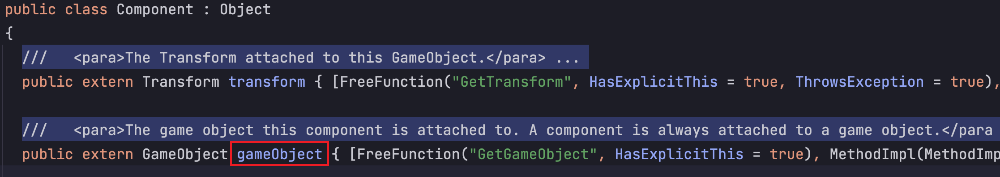
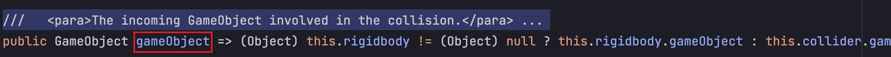
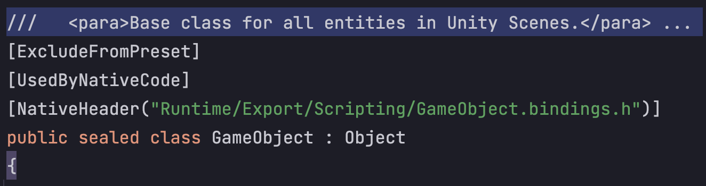
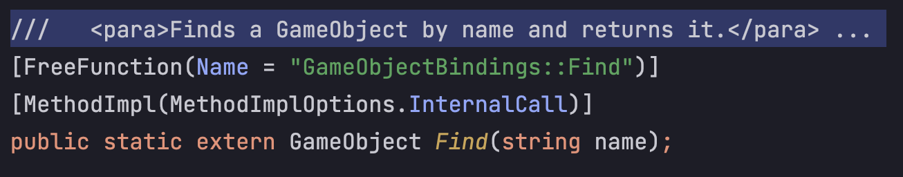
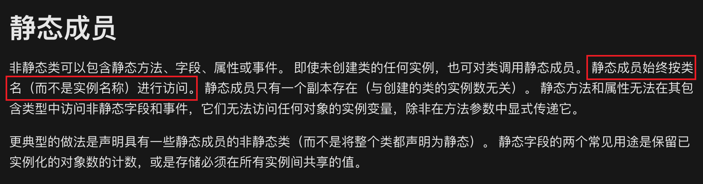

## 起因
跟着B站的教程学Unity，写了一些代码，然后发现代码里面包含了`gameobject`， `xx.gameobject`，`GameObject`好几种带有gameobject字眼的API调用，对于我这样对Unity很多机制和原理还不甚了解的新人来说，挺困惑的。但作为一名程序员，需要对自己的代码有控制力，不知道调哪个API，对调用的API不了解，是很难接受的。于是便仔细看了看反编译的代码，结合自己的理解梳理一下这几个API之间有什么区别，然后发布Blog记录、总结一下。

## 对比
下面包含了三个关于`gameobject`的代码片段
```csharp
/*死亡动画播放完成后Animation Event里调用该方法，使怪物消失。*/
private void Death()
{
    Destroy(gameObject);
}

/*player 碰撞回调*/
private void OnCollisionEnter2D(Collision2D collision)
{
    if (collision.gameObject.CompareTag("Enemy"))
    {
        if (_animator.GetBool(Falling))
        {
            var frog = collision.gameObject.GetComponent<FrogController>();
            frog.OnTrample();
            Jump(0.6f);
        }
        else
        {
            _animator.SetBool(Hurt, true);
            var frogX = collision.gameObject.transform.position.x;
            var direction = transform.position.x < frogX ? -1 : 1;
            _rigidbody2D.velocity = new Vector2(direction * 3, _rigidbody2D.velocity.y);
        }
    }
}

/*怪物初始化，获取角色对象，便于获取角色坐标信息*/
private void Start()
{
    player = GameObject.Find("/Player");
}
```
---
### gameobject
通过IDE代码跳转，可以发现`gameobject`跳转到`Component`类下面的gameobject属性



---
### xx.gameobject
`collision.gameobject`则是返回碰撞触发时`rigidbody`或`collider`的gameobject，rigidbody和collider本身就继承于`Component`



---
### GameObject
`GameObject`则跳转到了GameObject这个类



GameObject.Find()则是类下的一个静态方法，无需实例化便可以使用。




## 结论
由上面的对比可见，小写的`gameobject`通常指向组件挂载的物体或对象本身，`xx.gameobject`也是指向对应组件挂载的对象。而`GameObject`则不是对象，而是基类，需要使用其对应静态方法时才需要调用。其实从命名上来讲也可以看出来，驼峰命名的肯定是类，只是刚开始接触Unity，一下子使用好几个与`gameobject`相关字眼的API，比较容易混淆，仔细梳理后就清晰了很多。

## 思考
### this指针
既然相对梳理清楚了这几个API的差异，那必然能发现一些之前没注意到的细节。
例如，第一段直接调用gameobject，其实更清晰的用法是使用`this.gameobject`，指代Script组件对象本身所挂载的gameobject，Csharp和JAVA都有省略this指针的习惯，而如果是在Python里面，必然是使用`self.gameobject`，加了this，其实就更清晰了，指调用对象本身的gameobject属性，而不会疑惑这个gameobject是哪里来的，当然也算是Python和其他语言的一些差异了，习惯c++写法的程序员可能很习惯直接使用变量，而Python程序员更喜欢使用`self.xx`

---
### 使用实例访问静态方法
既然明白了GameObject.Find()是调用类的静态方法，那是否可以使用实例直接调用静态方法呢？
```csharp
player = GameObject.Find("/Player");
// 换成下面的调用方法
player = gameObject.Find("/Player");
```
我原以为是可以的，因为在Python里面这是常规的用法，实例通常拥有类所有成员的访问权限，具体点讲就是可以访问`method`，`classmethod`和`staticmethod`，结果没想到在Csharp里是不可以的。。

IDE提示`Cannot access static method 'Find' in non-static context`，查了下Microsoft官方文档，直接说明静态成员只能通过类名进行访问，amazing!!。至于原因，应该是和编译原理有关，讲起来就太长了，而且我也才开始接触Csharp，去看具体的原理太费时间，以后有时间单独写一篇Blog来讲这个问题。

